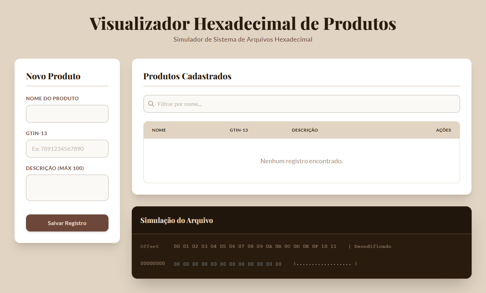
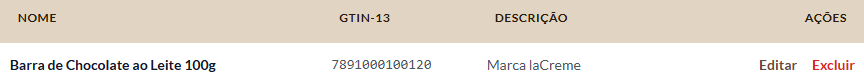
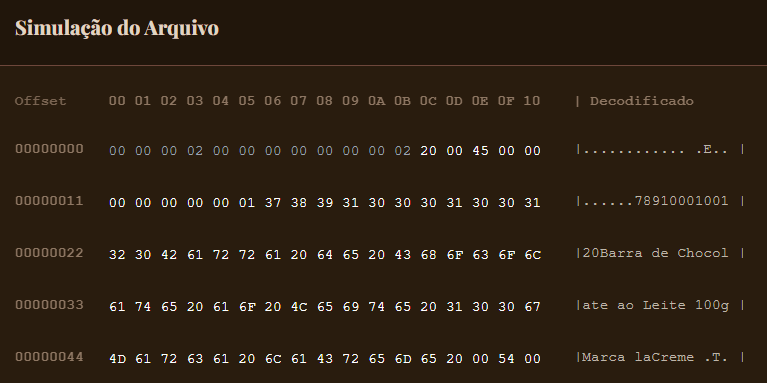
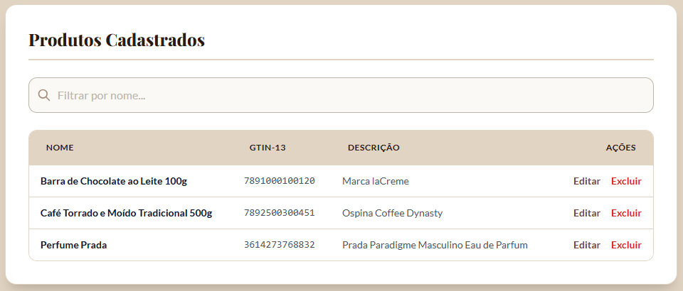
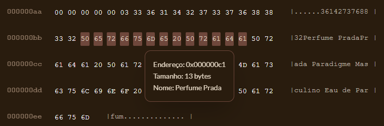
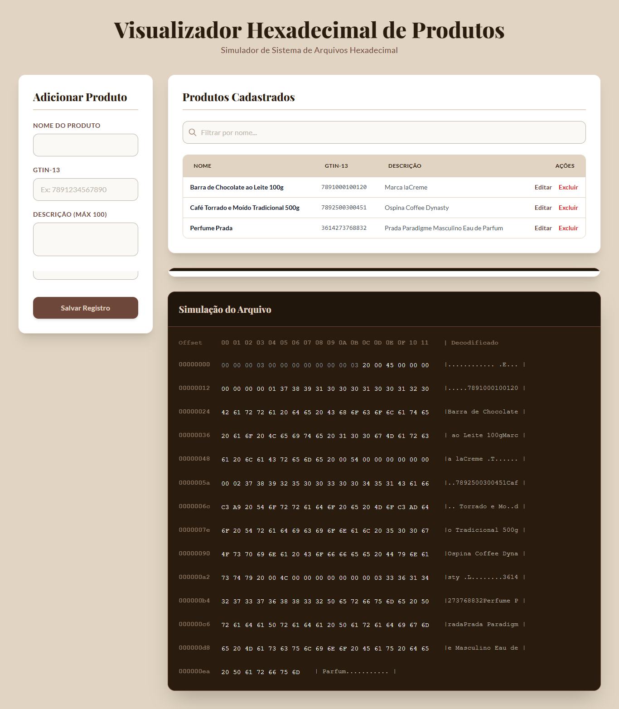
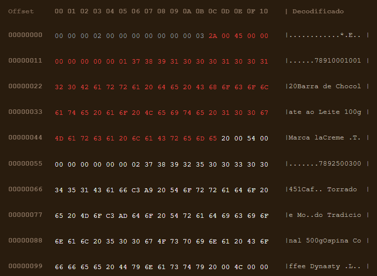
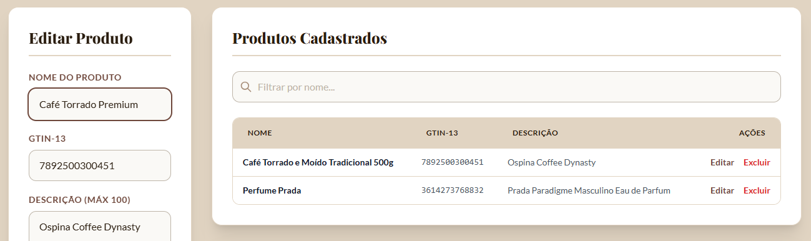
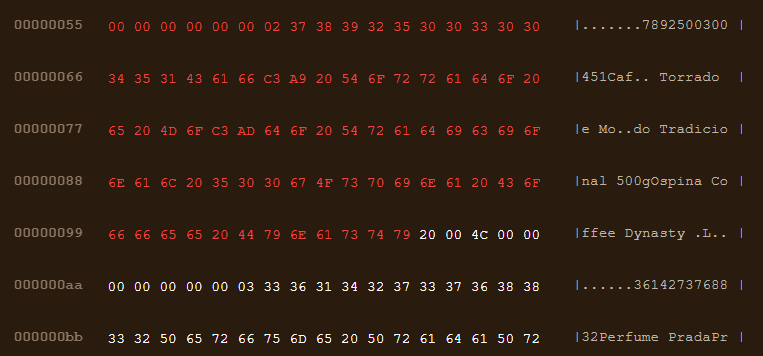
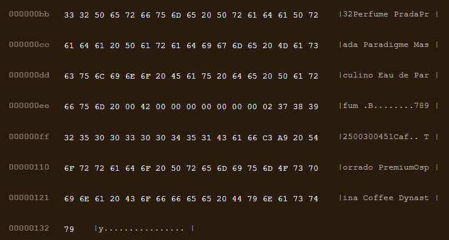

# AEDS3--TP4--Interface-web

## 📋 Relatório do Trabalho

### 1. Introdução

Este trabalho implementa um sistema de gerenciamento de produtos com interface web que simula o funcionamento de um arquivo binário de registros de tamanho variável. O sistema permite realizar operações CRUD (Create, Read, Update, Delete) em produtos e visualizar a representação hexadecimal dos dados armazenados, simulando como os registros seriam organizados em um arquivo físico.

**Objetivo Principal:** Desenvolver uma aplicação web que demonstre o funcionamento de arquivos sequenciais com registros de tamanho variável, incluindo técnicas de exclusão lógica (lápide) e visualização hexadecimal dos dados.

---

## 👥 Lista de Participantes

- Pessoa 1
- Pessoa 2
- Pessoa 3
- Pessoa 4
- Pessoa 5
- Pessoa 6
- Pessoa 7
- Pessoa 8
- Pessoa 9
- Pessoa 10

---

## 🧱 Estrutura do Projeto

```
meu-projeto/
│
├── index.html                → página principal
│
├── css/
│   └── style.css             → estilos gerais
│
├── js/
│   ├── models/
│   │   └── Produto.js        → definição da classe Produto
│   │
│   ├── services/
│   │   └── ProdutoService.js → CRUD (criar, ler, atualizar, deletar)
│   │
│   ├── controllers/
│   │   └── ProdutoController.js → lógica da interface (liga o HTML ao CRUD)
│   │
│   └── main.js               → script principal que inicializa tudo
│
└── assets/
    └── img/                  → imagens e ícones
```

---

## 🎯 Funcionalidades Implementadas

### 2.1. Operações CRUD

O sistema implementa todas as operações básicas de um CRUD:

- **Create (Criar):** Permite cadastrar novos produtos com nome, GTIN-13 e descrição
- **Read (Ler):** Lista todos os produtos cadastrados em uma tabela
- **Update (Atualizar):** Permite editar produtos existentes
- **Delete (Excluir):** Realiza exclusão lógica de produtos (marca como deletado)

### 2.2. Visualizador Hexadecimal

O sistema inclui um visualizador hexadecimal interativo que mostra:
- Representação byte a byte dos dados armazenados
- Endereços de memória (offsets)
- Valores hexadecimais
- Representação ASCII dos bytes
- Tooltips informativos ao passar o mouse sobre os bytes
- Realce visual de campos relacionados

### 2.3. Funcionalidades Adicionais

- **Busca/Filtro:** Permite filtrar produtos por nome
- **Validação:** Validação de campos obrigatórios e formato do GTIN-13
- **Feedback Visual:** Mensagens de sucesso/erro e indicador de salvamento
- **Interface Responsiva:** Layout adaptável para diferentes tamanhos de tela

---

## 🏗️ Arquitetura e Tecnologias

### 3.1. Padrão de Arquitetura

O projeto segue o padrão **MVC (Model-View-Controller)**:

- **Model (`Produto.js`):** Define a estrutura de dados do produto e calcula o tamanho do registro
- **View (`index.html` + `style.css`):** Interface do usuário e apresentação visual
- **Controller (`ProdutoController.js`):** Gerencia a lógica da aplicação e coordena a interação entre Model e View
- **Service (`ProdutoService.js`):** Camada de serviço que gerencia o acesso aos dados (LocalStorage)

### 3.2. Tecnologias Utilizadas

- **HTML5:** Estrutura da página
- **CSS3:** Estilização com variáveis CSS e animações
- **JavaScript (ES6+):** Lógica da aplicação com módulos ES6
- **Tailwind CSS:** Framework CSS utilitário (via CDN)
- **LocalStorage:** Armazenamento local dos dados (simula arquivo físico)
- **Google Fonts:** Tipografia (Lato e Playfair Display)

### 3.3. Paleta de Cores

O projeto utiliza uma paleta de cores temática "Coffee Shop":
- `--color-coffee: #291C0E` - Marrom escuro (texto principal)
- `--color-cocoa: #6E473B` - Marrom médio (destaques)
- `--color-latte: #A78D78` - Bege escuro (interações)
- `--color-stone: #BEB5A9` - Cinza quente (elementos secundários)
- `--color-cream: #E1D4C2` - Bege claro (fundo)



---

## 📊 Estrutura de Dados

### 4.1. Modelo de Produto

Cada produto possui os seguintes campos:

- **ID:** Identificador único (8 bytes, tipo Long/BigInt)
- **Nome:** Nome do produto (tamanho variável, codificado em UTF-8)
- **GTIN-13:** Código de barras (13 bytes, tamanho fixo)
- **Descrição:** Descrição do produto (tamanho variável, codificado em UTF-8, máximo 100 caracteres)
- **Ativo:** Flag booleana para exclusão lógica (1 byte - Lápide)

### 4.2. Estrutura do Registro no Arquivo

Cada registro no arquivo simulado possui a seguinte estrutura:

```
[Lápide: 1 byte] [Tamanho: 2 bytes] [ID: 8 bytes] [GTIN: 13 bytes] [Nome: N bytes] [Descrição: M bytes]
```

- **Lápide (1 byte):** 
  - `0x20` (espaço) = Registro ativo
  - `0x2A` (asterisco) = Registro deletado logicamente
- **Tamanho (2 bytes):** Tamanho total do registro em bytes (short int)
- **ID (8 bytes):** Identificador único do produto (long/bigint)
- **GTIN (13 bytes):** Código de barras (string fixa)
- **Nome (N bytes):** Nome do produto (string variável, UTF-8)
- **Descrição (M bytes):** Descrição do produto (string variável, UTF-8)

### 4.3. Cabeçalho do Arquivo

O arquivo possui um cabeçalho com metadados:

```
[Quantidade de Registros Ativos: 4 bytes] [Último ID Gerado: 8 bytes]
```

- **Quantidade de Registros Ativos (4 bytes):** Contador de registros não deletados
- **Último ID Gerado (8 bytes):** Contador para auto-incremento de IDs





---

## 🔧 Detalhes de Implementação

### 5.1. Classe Produto (Model)

A classe `Produto` é responsável por:
- Armazenar os dados do produto
- Calcular o tamanho total do registro em bytes
- Considerar a codificação UTF-8 para strings (caracteres especiais ocupam múltiplos bytes)

**Cálculo do Tamanho:**
```javascript
tamanho = 1 (lápide) + 2 (tamanho) + 8 (ID) + 13 (GTIN) + nomeBytes + descBytes
```

### 5.2. ProdutoService (Service)

O serviço gerencia todas as operações de persistência:

- **Inicialização:** Cria o cabeçalho do arquivo se não existir
- **Auto-incremento de ID:** Gerencia o contador de IDs automaticamente
- **Exclusão Lógica:** Marca registros como deletados (ativo = false) em vez de removê-los fisicamente
- **Atualização:** Implementa estratégia de "append" - marca o registro antigo como deletado e cria um novo no final do arquivo

**Estratégia de Atualização:**
Como os registros têm tamanho variável, uma atualização que altere o tamanho não pode simplesmente sobrescrever o registro original. A solução implementada:
1. Marca o registro antigo como deletado (lápide = 0x2A)
2. Cria um novo registro no final do arquivo com os dados atualizados
3. Mantém o mesmo ID lógico



### 5.3. ProdutoController (Controller)

O controlador gerencia toda a lógica da interface:

**Funcionalidades Principais:**
- Renderização da tabela de produtos
- Gerenciamento de formulário (criar/editar)
- Filtro de busca
- Conversão de dados para representação hexadecimal
- Renderização do visualizador hexadecimal
- Interatividade (tooltips, realce de campos)

**Conversão para Hexadecimal:**
- Números inteiros são convertidos para arrays de bytes hexadecimais
- Strings são codificadas em UTF-8 e convertidas para hex
- BigInt é usado para IDs grandes (8 bytes)

**Visualizador Hexadecimal:**
- Organiza os bytes em linhas (configurável, padrão 16 bytes por linha)
- Mostra endereços de memória (offsets)
- Exibe valores hexadecimais e representação ASCII
- Implementa tooltips informativos
- Realça campos relacionados ao passar o mouse



### 5.4. Interface HTML

A interface é dividida em três seções principais:

1. **Formulário (Coluna Esquerda):**
   - Campos para nome, GTIN-13 e descrição
   - Botões de salvar e cancelar
   - Feedback de operações

2. **Tabela de Produtos (Coluna Direita - Superior):**
   - Lista todos os produtos cadastrados
   - Campo de busca/filtro
   - Botões de ação (editar/excluir)

3. **Visualizador Hexadecimal (Coluna Direita - Inferior):**
   - Representação visual do arquivo binário
   - Interatividade com tooltips



---

## 🎨 Recursos Visuais e Interatividade

### 6.1. Visualizador Hexadecimal

O visualizador apresenta:
- **Régua de Offset:** Mostra a posição dos bytes na linha
- **Coluna Hexadecimal:** Valores hexadecimais de cada byte
- **Coluna ASCII:** Representação legível dos bytes (ou '.' para bytes não imprimíveis)
- **Cores Diferenciais:**
  - Cinza: Bytes do cabeçalho (metadados)
  - Branco: Bytes de registros ativos
  - Vermelho: Bytes de registros deletados (lápide)

### 6.2. Interatividade

- **Tooltip Global:** Ao passar o mouse sobre um byte, exibe:
  - Endereço hexadecimal do byte
  - Nome do campo (ex: RECORD_NOME, RECORD_ID)
  - Informações específicas do campo
  - Status do registro (ativo/deletado)

- **Realce de Bloco:** Ao passar o mouse sobre um byte, todos os bytes do mesmo campo são realçados simultaneamente

- **Indicador de Salvamento:** Animação "Gravando..." durante operações de escrita



---

## 🔄 Fluxo de Operações

### 7.1. Criação de Produto

1. Usuário preenche o formulário
2. Sistema valida os dados (nome obrigatório, GTIN com 13 caracteres)
3. Cria instância da classe `Produto`
4. `ProdutoService` gera ID automaticamente (auto-incremento)
5. Registro é adicionado ao final do array (append)
6. Dados são salvos no LocalStorage
7. Interface é atualizada (tabela e visualizador)

### 7.2. Edição de Produto

1. Usuário clica em "Editar" na tabela
2. Formulário é preenchido com os dados do produto
3. Usuário modifica os dados
4. Ao salvar:
   - Registro antigo é marcado como deletado (ativo = false)
   - Novo registro é criado no final do arquivo com os dados atualizados
   - ID é mantido
5. Interface é atualizada

### 7.3. Exclusão de Produto

1. Usuário clica em "Excluir" na tabela
2. Sistema marca o registro como deletado (ativo = false, lápide = 0x2A)
3. Registro permanece no arquivo, mas não aparece na listagem
4. Visualizador hexadecimal mostra o registro em vermelho (deletado)

### 7.4. Visualização Hexadecimal

1. Sistema lê todos os registros do LocalStorage
2. Converte cada campo para bytes hexadecimais
3. Organiza os bytes sequencialmente (cabeçalho + registros)
4. Renderiza em linhas de 16 bytes (ou conforme largura da tela)
5. Adiciona eventos de interação (hover, tooltip)







---

## 💾 Persistência de Dados

### 8.1. LocalStorage

O sistema utiliza o LocalStorage do navegador para simular um arquivo físico:

- **Chave `aeds3_crud_db`:** Armazena o array de produtos (JSON)
- **Chave `aeds3_header_db`:** Armazena os metadados do arquivo (JSON)

### 8.2. Modo de Teste

Por padrão, o sistema está configurado em modo de teste que:
- Limpa o LocalStorage a cada recarregamento da página
- Reinicia os contadores (IDs começam do zero)
- Garante testes sempre começando do estado inicial

Para desativar o modo de teste, comente as linhas de limpeza no arquivo `main.js`.

---

## 🎯 Conclusão

O trabalho implementa com sucesso um sistema de gerenciamento de produtos que simula o funcionamento de arquivos binários com registros de tamanho variável. As principais conquistas incluem:

1. **Estrutura de Dados:** Implementação correta de registros de tamanho variável com lápide
2. **Operações CRUD:** Todas as operações básicas funcionando corretamente
3. **Exclusão Lógica:** Implementação da técnica de lápide para exclusão lógica
4. **Visualização Hexadecimal:** Visualizador interativo e informativo
5. **Interface Moderna:** Design responsivo e intuitivo
6. **Código Organizado:** Arquitetura MVC bem estruturada e código comentado

O sistema demonstra de forma clara e visual como os dados são organizados em arquivos binários, facilitando o entendimento de conceitos fundamentais de estruturas de dados e sistemas de arquivos.

---

## 📝 Observações Técnicas

### 9.1. Codificação de Caracteres

O sistema utiliza UTF-8 para codificação de strings, o que significa que:
- Caracteres ASCII ocupam 1 byte
- Caracteres acentuados podem ocupar 2 ou mais bytes
- O cálculo do tamanho do registro considera os bytes reais, não o número de caracteres

### 9.2. Responsividade

O visualizador hexadecimal ajusta automaticamente o número de bytes por linha baseado na largura da tela:
- Mínimo: 8 bytes por linha
- Máximo: 32 bytes por linha
- Padrão: 16 bytes por linha

### 9.3. Validações

- Nome: Campo obrigatório
- GTIN-13: Deve ter exatamente 13 caracteres
- Descrição: Máximo de 100 caracteres

---

## ✅ Checklist

### 10.1. Verificação de Requisitos

**1. A página web com a visualização interativa do CRUD de produtos foi criada?**
- **Resposta:** Sim

**2. Há um vídeo de até 3 minutos demonstrando o uso da visualização?**
- **Resposta:** Sim

**3. O trabalho foi criado apenas com HTML, CSS e JS?**
- **Resposta:** Sim

**4. O relatório do trabalho foi entregue no APC?**
- **Resposta:** A fazer

**5. O trabalho está completo e funcionando sem erros de execução?**
- **Resposta:** Sim

**6. O trabalho é original e não a cópia de um trabalho de outro grupo?**

- **Resposta:** Sim
